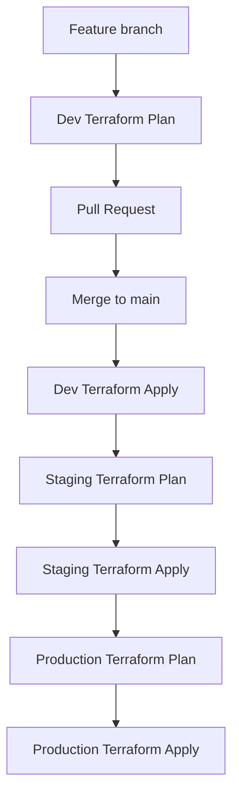

# Dummy Infra

Simple Terraform setup for a small multi-environment AWS deployment.

## What this repo does

- Uses one reusable Terraform module in `modules/app_infra`
- Keeps separate Terraform configuration for `dev`, `staging`, and `prod`
- Stores Terraform state remotely in S3
- Uses GitHub Actions with OIDC to assume AWS IAM roles
- Runs Terraform static checks and plans in CI
- Promotes changes sequentially from Dev → Staging → Production

## Repository layout

```text
.
├── envs/
│   ├── dev/
│   ├── staging/
│   └── prod/
├── modules/
│   └── app_infra/
├── .github/workflows/
│   ├── terraform-reusable.yml
│   ├── terraform-checks.yml
│   ├── terraform-dev-ci.yml
│   └── terraform-deploy.yml
├── README.md
└── .gitignore
```

## Environments

- `dev` → `eu-central-1`
- `staging` → `eu-west-1`
- `prod` → `us-east-1`

Each environment has its own backend state key and `tfvars` file.

## Remote state

Terraform uses a shared S3 backend:

- Bucket: `nikola-tf-state-demo`
- Keys:
  - `dev/app_infra.tfstate`
  - `staging/app_infra.tfstate`
  - `prod/app_infra.tfstate`

The backend uses:

```hcl
use_lockfile = true
```

## GitHub Actions workflow

This repository follows a trunk-based development model with GitHub Flow-style pull requests.

Feature branches are short-lived and changes are integrated into `main` through pull requests.

Pull requests run Terraform static checks and a Dev plan. After a change is merged into `main`, the deployment pipeline promotes the change sequentially through Dev, Staging, and Production.

### CI checks

Pull requests run Terraform checks for all environments:

- `terraform fmt -check`
- `terraform validate`
- `tflint`

For feature branches and pull requests targeting `main`, the Dev environment also runs:

- `terraform plan`

### Deployment flow



The deployment flow follows a sequential promotion model:

1. Feature branch → Dev Terraform plan
2. Pull request → Terraform checks and Dev plan
3. Merge to `main` → Dev Terraform apply
4. Staging Terraform plan
5. Staging Terraform apply
6. Production Terraform plan
7. Production Terraform apply

Staging and Production are represented as separate GitHub Environments. If environment protection rules are configured with required reviewers, the workflow pauses for approval before the corresponding deployment proceeds.

The reusable workflow targets the GitHub environment dynamically:

```yaml
environment: ${{ inputs.environment }}
```

This allows the same reusable Terraform workflow to be used consistently across Dev, Staging, and Production.

## Reusable Terraform workflow

The reusable workflow performs the following steps:

1. Checkout repository
2. Configure AWS credentials via GitHub OIDC
3. Setup Terraform
4. Initialize the remote backend
5. Run `terraform validate`
6. Run either `terraform plan` or `terraform apply`

The workflow also uses environment-specific:

- AWS IAM role
- AWS region
- Terraform working directory
- Terraform variables file

## Local usage

Example for Dev:

```bash
cd envs/dev

terraform init
terraform plan -var-file="dev.tfvars"
terraform apply -var-file="dev.tfvars"
```

To clean up:

```bash
terraform destroy -var-file="dev.tfvars"
```

Repeat the same pattern for `staging` and `prod` using their matching `tfvars` files.

## Notes

- AWS authentication uses GitHub OIDC instead of static AWS access keys.
- Terraform state is stored remotely in S3.
- Each environment has an independent Terraform state.
- The repository uses a reusable GitHub Actions workflow to keep Terraform pipeline logic consistent.
- Staging and Production are promoted sequentially after successful lower-environment deployment.
- The project intentionally keeps the CI/CD implementation simple and lightweight for a demo or personal IaC project.