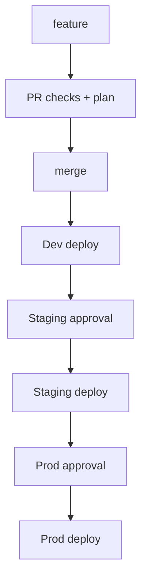

# Dummy Infra

Simple Terraform setup for a small multi-environment AWS deployment.

## What this repo does

- Uses one reusable Terraform module in `modules/app_infra`
- Keeps separate Terraform config for `dev`, `staging`, and `prod`
- Stores state remotely in S3
- Uses GitHub Actions with OIDC to assume AWS roles
- Runs `plan` on feature branches and `apply` in higher environments

## Repository layout

```text
.
├── envs/
│   ├── dev/
│   ├── staging/
│   └── prod/
├── modules/
│   └── app_infra/
├── .github/workflows/
│   ├── terraform-reusable.yml
│   ├── terraform-dev-ci.yml
│   └── terraform-deploy.yml
├── README.md
└── .gitignore
```

## Environments

- `dev` → `eu-central-1`
- `staging` → `eu-west-1`
- `prod` → `us-east-1`

Each environment has its own backend key and `tfvars` file.

## Remote state

Terraform uses a shared S3 backend:

- Bucket: `nikola-tf-state-demo`
- Keys:
  - `dev/app_infra.tfstate`
  - `staging/app_infra.tfstate`
  - `prod/app_infra.tfstate`

This is configured with `use_lockfile = true`.

## Current GitHub Actions workflow

This is a trunk-based development model with GitHub Flow-style pull requests, and a gated environment promotion pipeline from Dev → Staging → Production.

Feature branches are short-lived and changes are integrated into `main` through pull requests. Pull requests run Terraform validation and plan, while merges to `main` trigger deployment to Dev, followed by protected Staging and Production environments requiring manual approval.

### Dev checks

- Push to `feature/*` → runs `terraform plan` for `dev`
- Pull request to `main` from a feature branch → runs `terraform plan` for `dev`

### Deployments



- Push to `main` → runs `terraform apply` for `staging` (this is the normal path after a merge)
- Manual workflow dispatch on `main` for `prod` → runs `terraform apply` for `prod`

Important: both jobs target a GitHub environment via `environment: ${{ inputs.environment }}` in the reusable workflow. If the `staging` or `prod` environment is configured with required reviewers/approvals, the workflow pauses for approval before Terraform runs.

The reusable workflow does this:

1. Checkout repo
2. Configure AWS credentials via OIDC
3. Setup Terraform
4. `terraform init`
5. `terraform validate`
6. `terraform plan` or `terraform apply`

A possible improvement is to save the Terraform plan output as a GitHub Actions artifact after the plan step, then reuse that artifact in later environment jobs. This makes the pipeline easier to audit and reduces the risk of planning in one stage and applying a different state in another.

## Local usage

Example for dev:

```bash
cd envs/dev
terraform init
terraform plan -var-file="dev.tfvars"
terraform apply -var-file="dev.tfvars"
```

To clean up:

```bash
terraform destroy -var-file="dev.tfvars"
```

Repeat the same pattern for `staging` and `prod` using their matching `tfvars` files.

## Notes

- AWS auth is done with GitHub OIDC, not static keys.
- The repo uses a reusable workflow to keep pipeline logic consistent.
- This is intentionally simple and lightweight for a demo or personal IaC project.


